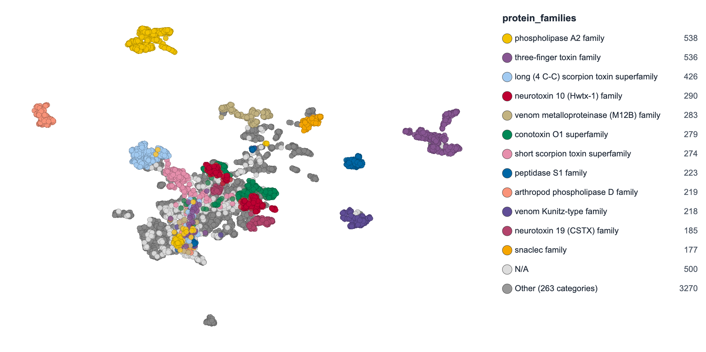

# ProtSpace

[](https://badge.fury.io/py/protspace)
[](https://www.python.org/downloads/)
[](https://www.gnu.org/licenses/gpl-3.0)
[](https://pepy.tech/project/protspace)
[](https://doi.org/10.1016/j.jmb.2025.168940)

ProtSpace is a visualization tool for exploring **protein embeddings** or **similarity matrices**. It projects high-dimensional protein language model data into 2D space, color-codes proteins by biological annotations, and exports publication-ready figures.

- **Multiple projections**: PCA, UMAP, t-SNE, MDS, PaCMAP
- **Automatic annotations**: UniProt, InterPro, and Taxonomy
- **Structure viewer**: Integrated protein structure visualization
- **Export**: PNG, PDF, SVG, HTML

## 🌐 Try Online

**[ProtSpace Web](https://protspace.app/explore)** _(recommended)_: Fast 2D explorer optimized for large datasets — drag & drop `.parquetbundle` files ([source](https://github.com/tsenoner/protspace_web))

**[Legacy Dash frontend](https://protspace.rostlab.org/)**: Original interface with 3D support (slow with large datasets)

## 🚀 Google Colab Notebooks

**Note**: Use Chrome or Firefox for best experience.

1. **Generate Protein Embeddings**: [](https://colab.research.google.com/github/tsenoner/protspace/blob/main/notebooks/ClickThrough_GenerateEmbeddings.ipynb)

2. **Prepare ProtSpace Bundle**: [](https://colab.research.google.com/github/tsenoner/protspace/blob/main/notebooks/ProtSpace_Preparation.ipynb)

3. **Full Pipeline Demo**: [](https://colab.research.google.com/github/tsenoner/protspace/blob/main/notebooks/Run_ProtSpace.ipynb)

## 📦 Installation

```bash
pip install protspace
```

## 🎯 Quick Start

### 1. Process local data

```bash
protspace-local -i embeddings.h5 -o output_dir -m pca2,umap2
```

### 2. Explore results

Upload the generated `.parquetbundle` file at [protspace.app/explore](https://protspace.app/explore).

## 📊 Example Output



## ✨ Annotations

Use `-a` to color-code proteins by UniProt, InterPro, or Taxonomy annotations. Groups (`default`, `all`, `uniprot`, `interpro`, `taxonomy`) and individual names can be mixed freely. If `-a` is omitted, the `default` group is used.

```bash
protspace-local -i data.h5                              # default UniProt annotations (fast)
protspace-local -i data.h5 -a default,interpro,kingdom  # mix groups and individual names
```

## 📖 Documentation

- [Annotation Reference](docs/annotations.md) — full list of annotations, groups, data sources, output formats
- [CLI Reference](docs/cli.md) — command options, method parameters, file formats

## 📝 Citation

Senoner T, Olenyi T, Heinzinger M, Spannagl A, Bouras G, Rost B, Koludarov I. ProtSpace: A Tool for Visualizing Protein Space. *Journal of Molecular Biology*, 168940, 2025. [doi:10.1016/j.jmb.2025.168940](https://doi.org/10.1016/j.jmb.2025.168940)
