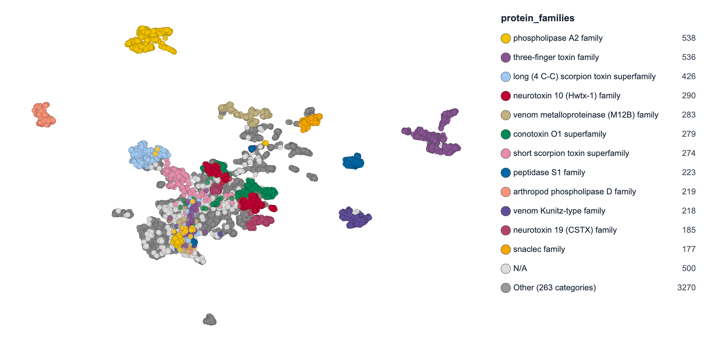

# ProtSpace

[](https://badge.fury.io/py/protspace)
[](https://www.python.org/downloads/)
[](https://opensource.org/licenses/MIT)
[](https://pepy.tech/project/protspace)
[](https://doi.org/10.64898/2026.05.04.722720)
[](https://doi.org/10.1016/j.jmb.2025.168940)

ProtSpace maps the **embedding space** of protein language models (pLMs) to reveal relationships that sequence similarity misses. This Python package **prepares** your data — embed sequences, project to 2D, overlay biological annotations (UniProt, InterPro, AlphaFold/TED, ML predictions), and transfer labels from the nearest neighbour in embedding space (EAT) — then bundles everything into a `.parquetbundle` you explore interactively at [protspace.app](https://protspace.app), nothing uploaded. Similarity matrices are supported as input too.

- **Multiple projections**: linear and non-linear dimensionality reduction (PCA, UMAP, t-SNE, and more)
- **Automatic annotations**: UniProt, InterPro, Taxonomy, TED domains, and Biocentral predictions
- **Quality metrics** _(opt-in)_: annotation-based cluster-validity + faithfulness (local & global) via `--stats`
- **Annotation transfer** _(EAT)_: fill missing annotations from the nearest reference proteins in embedding space via `protspace transfer`
- **Structure viewer**: Integrated protein structure visualization
- **Export**: PNG, PDF, SVG, HTML

## 🌐 Try Online

**[ProtSpace web app](https://protspace.app/explore)**: Fast 2D explorer optimized for large datasets — drag & drop `.parquetbundle` files ([source](https://github.com/tsenoner/protspace))

## 🚀 Google Colab Notebooks

**Note**: Use Chrome or Firefox for best experience.

1. **Generate Protein Embeddings**: [](https://colab.research.google.com/github/tsenoner/protspace/blob/main/apps/protspace/notebooks/ClickThrough_GenerateEmbeddings.ipynb)

2. **Prepare ProtSpace Bundle**: [](https://colab.research.google.com/github/tsenoner/protspace/blob/main/apps/protspace/notebooks/ProtSpace_Preparation.ipynb)

3. **Transfer Annotations (EAT)**: [](https://colab.research.google.com/github/tsenoner/protspace/blob/main/apps/protspace/notebooks/ProtSpace_Transfer.ipynb)


## 📦 Installation

```bash
pip install protspace
```

## 🎯 Quick Start

### 1. Prepare data

```bash
# From HDF5 embeddings
protspace prepare -i embeddings.h5 -m pca2,umap2 -o output

# From FASTA (auto-embeds via Biocentral API)
protspace prepare -i sequences.fasta -e prot_t5 -m pca2 -o output

# Multi-model comparison (compare across pLMs)
protspace prepare -i sequences.fasta -e prot_t5,esm2_650m,ankh_base -m pca2,umap2 -o output

# Combine datasets (same embedding name → proteins are unioned)
protspace prepare -i species_a.h5:prot_t5 -i species_b.h5:prot_t5 -m umap2 -o output
```

### 2. Explore results

Upload the generated `.parquetbundle` file at [protspace.app/explore](https://protspace.app/explore).

### 3. Power-user workflow (individual steps)

```bash
protspace embed -i sequences.fasta -e prot_t5 -e esm2_3b -o embeddings/
protspace project -i embeddings/prot_t5.h5 -i embeddings/esm2_3b.h5 -m pca2,umap2 -o projections/
protspace annotate -i embeddings/prot_t5.h5 -a default -o annotations.parquet
protspace stats -i embeddings/prot_t5.h5 -p projections/ -o statistics.parquet   # optional: quality metrics
protspace bundle -p projections/ -a annotations.parquet -s statistics.parquet -o output.parquetbundle
protspace transfer -b output.parquetbundle -e embeddings/prot_t5.h5 -t superfamily -o transferred.parquetbundle   # optional: fill gaps via EAT
```

Or compute quality metrics inline during `prepare` with `--stats` (opt-in): annotation-based cluster-validity + faithfulness per projection. See the [CLI Reference](docs/cli.md#projection-statistics---stats).

Fill missing annotation values from the nearest annotated protein in embedding space with [`protspace transfer`](docs/cli.md#protspace-transfer) — Embedding Annotation Transfer (EAT).

## 📊 Example Output



## ✨ Annotations

Use `-a` to color-code proteins by UniProt, InterPro, Taxonomy, TED domain, and Biocentral prediction annotations. Groups (`default`, `all`, `uniprot`, `interpro`, `taxonomy`, `ted`, `biocentral`) and individual names can be mixed freely. If `-a` is omitted, the `default` group is used.

```bash
protspace prepare -i data.h5 -m pca2                              # default annotations
protspace prepare -i data.h5 -a default,interpro,kingdom -m pca2  # mix groups + individual
```

## 📖 Documentation

- [Annotation Reference](docs/annotations.md) — full list of annotations, groups, data sources, output formats
- [Annotation Styling](docs/styling.md) — custom colors, shapes, sort modes, and the `--generate-template` workflow
- [CLI Reference](docs/cli.md) — command options, method parameters, file formats

## 📝 Citation

If you use ProtSpace, please cite the web application preprint (latest):

Senoner T, Vahidi P, Olenyi T, Senoner F, Sisman G, Kahl E, Rost B, Koludarov I. ProtSpace: Protein Universe in Your Browser. *bioRxiv*, 2026. [doi:10.64898/2026.05.04.722720](https://doi.org/10.64898/2026.05.04.722720)

The original, peer-reviewed ProtSpace publication:

Senoner T, Olenyi T, Heinzinger M, Spannagl A, Bouras G, Rost B, Koludarov I. ProtSpace: A Tool for Visualizing Protein Space. *Journal of Molecular Biology*, 437(15), 168940, 2025. [doi:10.1016/j.jmb.2025.168940](https://doi.org/10.1016/j.jmb.2025.168940)
