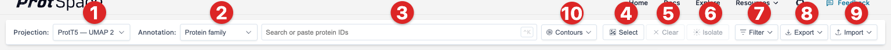
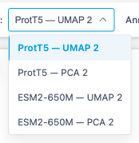
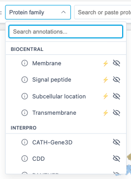
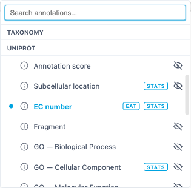
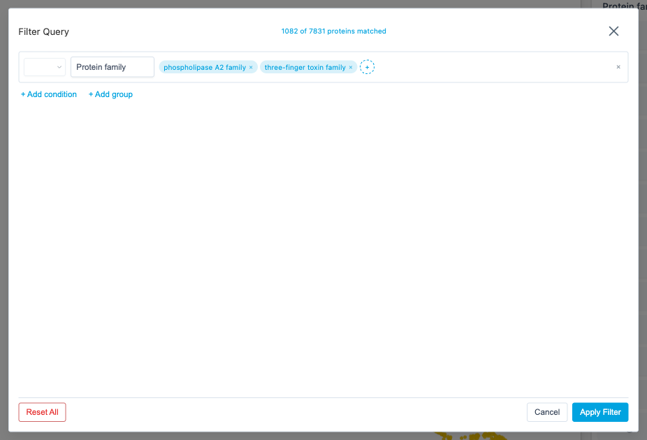
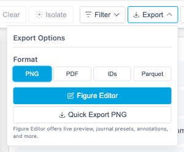

# Control Bar Features

The control bar at the top provides tools for data management, selection, density contours, export, and import.

## 1. Projection Selector

Switch between different dimensionality reduction methods:

| Method     | Best For                           |
| ---------- | ---------------------------------- |
| **PCA**    | Initial overview, finding outliers |
| **UMAP**   | General exploration, balanced view |
| **t-SNE**  | Finding clusters                   |
| **PaCMAP** | Fast alternative to t-SNE          |
| **MDS**    | Preserving distances               |

Different projections reveal different patterns - try switching between them!

::: info URL persistence
Your current projection is reflected in the page URL, so refresh, browser back/forward navigation, and shared links reopen the same view when possible. A bare `/explore` URL stays unchanged on first load; ProtSpace writes projection and annotation params after you change the view or when it needs to normalize an invalid URL value.
:::

::: tip 3D Projections
3D projections load normally and are shown as their X/Y view; the third (Z) dimension is not rendered in the web viewer.
:::

## 2. Annotation Selector

Choose which annotation to use for coloring points:

The Annotation dropdown features:

- **Grouped categories**: Features are organized into sections (UniProt, InterPro, Taxonomy, Other)
- **Search**: Type to filter features by name (case-insensitive)
- **Keyboard navigation**: Use arrow keys to move the highlight, Enter to select, Escape to close.
  Hovering does not move the arrow-key highlight, and Enter picks the row under the pointer whenever
  one is hovered.

Only categories present in your dataset appear in the dropdown. Any columns that don't match a known category appear under **Other**. See the [ProtSpace Python package](https://github.com/tsenoner/protspace) for the complete list of available annotations per source.

::: info ⚡ Predicted badge
A ⚡ badge next to an annotation name marks a **computational prediction** rather than curated or
experimental data. Hover it for the tooltip "Predicted: computational, not experimentally
curated". The same badge appears next to the legend title when a predicted annotation is active.

Flagged annotations are:

- **Signal peptide (Phobius)**, de-novo topology predictor
- **TED domains**, domains parsed from predicted AlphaFold structures
- All **Biocentral** columns: Subcellular location, Membrane, Signal peptide, Transmembrane
- Any other column whose name starts with `predicted_`

Reference signature-database matches (Pfam, CATH-Gene3D, SUPERFAMILY, SMART, CDD, PANTHER) and
curated data (UniProt, Taxonomy) are deliberately **not** flagged. See
[Annotations](/guide/annotations) for the full column reference.
:::

::: info STATS badge
A **STATS** badge marks an annotation that the bundle scored **for the projection you are currently
viewing**. It carries no number; it only says the scores exist. Hover it for the tooltip "Quality
statistics available: select this annotation and open the projection metadata panel".

The badge disappears when you switch to a projection the annotation was not scored on. Select the
annotation and open the [projection metadata panel](/explore/scatterplot#projection-metadata) to
read the numbers, or see [Separation Scores](/explore/separation-scores) for what they mean.
:::

::: info EAT badge
An **EAT** badge marks an annotation in which some proteins carry a value **transferred from a
nearby annotated protein** instead of a curated record of their own, not to be confused with the ⚡
badge. Hover it for the tooltip "Embedding Annotation Transfer predictions available". Select the
annotation to see which proteins those are, and to get the `Predicted (transferred)` controls in the
[legend](/explore/legend). See [Transferred Annotations (EAT)](/explore/eat) for the whole feature.
:::

::: info Tooltip-only annotations
`gene_name`, `protein_name`, and `uniprot_kb_id` are excluded from the dropdown but are still shown in the [tooltip](/explore/scatterplot#protein-tooltip) on hover.
:::

## 3. Search

Find specific proteins by ID:

1. Click inside the search box or press **⌘/Ctrl + K** to focus it
2. Type the start of a protein ID (matching is anchored to the start, not anywhere inside)
3. Click a suggestion, or press **Enter** to take the highlighted row: the first row is highlighted
   as soon as you type, and the arrow keys move the highlight. Hovering does not move it, so a
   reflexive **Enter** on an ID you already selected deselects it
4. An unselected protein joins your selection, the box clears, and the list closes. One that is
   already selected is listed with a `✓`, gains a `✕` on hover or highlight, and is **removed**
   instead, leaving your query and the open list in place so you can prune several in a row

Focusing an empty box lists up to 10 proteins from your current selection, mixed in dataset order
with the first unselected IDs. An ID the dataset does not contain shows
`No matching protein IDs found`.

::: tip Multiple IDs
Paste multiple IDs at once (newline or space separated) and all matching proteins will be selected. Useful for re-selecting a previously exported subset. Pasting a list only ever adds.
:::

## 4. Selection Tools

Click **Select** to enter selection mode. A tool picker appears with two options:

- **Rectangle** (default), drag to draw a box around proteins
- **Lasso**, draw a freeform outline around proteins

See [Box Selection](/explore/scatterplot#box-selection) and [Lasso Selection](/explore/scatterplot#lasso-selection) for details.

## 5. Clear Button

Click **Clear** (or press **Escape**) to remove all current selections. Pressing **Escape** again will exit selection mode. **Escape** while the cursor is in the search box only closes the suggestion list and empties the box; it never clears the selection, however many times you press it.

## 6. Isolate Button

**Isolate** focuses on selected proteins by hiding all others:

1. Select one or more proteins (using search, click, or box select)
2. Click **Isolate**
3. Only selected proteins remain visible
4. Click **Reset** (appears when isolated) to restore all proteins

::: tip Use Case
Isolate is useful for examining relationships within a specific protein subset - hiding unrelated proteins reduces visual clutter.
:::

## 7. Filter Button

**Filter** opens a query builder modal for building complex annotation-based filters:

1. Click **Filter** to open the query builder
2. Each row is a condition: select an annotation, then click **+** to pick values
3. Combine conditions with **AND**, **OR**, or **NOT** logic
4. Use **+ Add group** for nested logic (parenthetical grouping)
5. The live match count shows how many proteins match your query
6. Click **Apply & Isolate** to filter the scatterplot

### Numeric range conditions

Some annotations hold numbers rather than categories (for example `length`). When you pick a
numeric annotation, the row **switches to numeric mode automatically**, the **+** value picker is
replaced by a range input. There is no query text to type; you choose an operator and fill in the
bound(s):

| Operator  | Fields shown | Matches                              |
| --------- | ------------ | ------------------------------------ |
| `>`       | min          | value **strictly** greater than min  |
| `<`       | max          | value **strictly** less than max     |
| `between` | min and max  | min ≤ value ≤ max (**both ends** in) |

`>` is the default operator on a new numeric condition. Switching operators clears any bound the
new operator does not use, so a hidden value cannot silently re-constrain the filter.

For example, `length` `between` `100` and `300` matches proteins with 100 ≤ length ≤ 300 (both ends
included), while `length` `>` `500` excludes a protein of exactly length 500.

Comparisons use the **raw numeric value**, not the legend's bin labels, so the bin settings in the
[legend](/explore/legend) do not affect which proteins a numeric condition matches.

A condition with a missing bound matches nothing, and the live match count only appears once the
condition is complete.

::: warning Missing values
A protein with no value for the annotation never matches `>`, `<`, or `between`. Wrapping the
condition in **NOT** re-includes those proteins, because NOT is the complement of the matched set.
There is no numeric equivalent of the categorical N/A entry you can pick from a value list.
:::

Close the modal with the **×** button, **Cancel**, **Escape** key, or clicking the backdrop.

**Reset All** clears the query and restores all proteins without closing the modal.

::: tip Logical Operators

- **AND**: Protein must match both conditions
- **OR**: Protein must match either condition
- **NOT**: Protein must have a value for the annotation **and** not match the condition

The first condition can optionally be set to **NOT** for immediate negation.

**NOT** deliberately excludes proteins with no value (N/A) for the annotation
being negated. "NOT phospholipase A2" means "belongs to some other family", not
"belongs to some other family, or has no family assigned at all". To include
unannotated proteins as well, add an explicit **N/A** condition with **OR**.
:::

::: tip Missing values

Annotations offer presence entries alongside their real values:

- **N/A**: proteins with no value for this annotation — listed whenever the
  annotation actually has missing values
- **Any value**: proteins that have some value — any value at all; always offered

**Any value** is exclusive: selecting it clears the other values, since "Any
value or X" is just "Any value".

Numeric annotations offer the same two entries next to their comparison, so
`≥ 0.7` plus **N/A** reads "at least 0.7, or no score at all". A presence entry
on its own is a complete condition — no bounds needed.
:::

::: tip Numeric comparisons

Numeric conditions support `>`, `≥`, `<`, `≤`, and `between` (inclusive on both
ends). Missing values never satisfy a comparison — use the **N/A** entry to
include them.
:::

::: info Filter vs Isolate
Both reduce visible proteins, but they work differently:

- **Filter**: Build annotation-based queries (e.g., "show all Human AND reviewed proteins")
- **Isolate**: Manually select proteins first, then hide everything else

Use **Filter** for structured queries. Use **Isolate** for ad-hoc selections.
:::

## 8. Export

Click **Export** to save your visualization:

| Format          | Description                                               |
| --------------- | --------------------------------------------------------- |
| **PNG**         | Raster image with legend                                  |
| **PDF**         | PDF document with legend                                  |
| **Protein IDs** | Text file with newline-separated identifiers              |
| **Parquet**     | `.parquetbundle` file with all data and optional settings |

See [Exporting Results](/explore/exporting) for image customization options (dimensions, legend size, font).

## 9. Import

Click **Import** to load a `.parquetbundle` file from your computer.

The picker also accepts FASTA files (`.fasta`, `.fa`, `.fna`): ProtSpace sends the sequences to the
prep service, which computes embeddings and projections and then opens the resulting bundle
automatically. See [Importing Data](/explore/importing-data) for the full flow, size limits, and
privacy implications.

You can also drag & drop either file type directly onto the scatterplot.

## 10. Contours

**Contours**, the button just right of the search box, draws density rings over the points, so you
can see where each category concentrates even where its points pile on top of each other. While
Auto or Always is selected, the button is highlighted and names the mode: **Contours: Auto** or
**Contours: Always**.

| Mode              | What it does                                                        |
| ----------------- | ------------------------------------------------------------------- |
| **Off** (default) | No contours                                                         |
| **Auto**          | Fades out as you zoom in; faint or hidden when few points are shown |
| **Always**        | Full strength at every zoom level                                   |

Auto and Always draw the same rings and fill; only their strength differs. Auto sets it from how
many points are visible, how large the plot is and how far you have zoomed in. It does not check
whether points actually overlap.

How to read them:

- Every legend colour gets its own set of rings in that colour. Each ring inward marks a doubling
  of density, and a light fill deepens toward the densest core.
- A spot needs more than 5 points of one colour close together (about 7 piled on one spot) before it
  gets a ring, so scattered points get none.
- Hidden categories are left out, and selected points are drawn on top of the contours.
- Categories that share a colour share rings. Past 16 colours, the 15 largest keep their own rings
  and the rest share one grey set. N/A rings are light grey, so they are faint on a light
  background.
- The rings are computed on a fixed grid across the plot, so they sit in the same place on every
  screen and at every browser zoom, and lines are equally thick everywhere.

The menu works from the keyboard: with the button focused, **Enter** or **Space** opens it, the
arrow keys, **Home** and **End** move the highlight, **Enter** picks, and **Escape** closes it.

::: tip Auto on small datasets
Auto counts the visible points. In the full view of a plot about 1000 px wide it shows nothing below
about 360 visible points and reaches full strength from about 2,700, and a wider plot needs more.
Points you hide, filter out or isolate away do not count. For a small dataset, such as a FASTA
upload, or a small subset, pick **Always**.
:::

::: info URL persistence
The mode is kept in the page URL as `density=auto` for Auto or `density=on` for Always; Off leaves
the parameter out. A shared link opens with the same mode.
:::

::: warning Not in exported images yet
Contours are not drawn in exported images (Quick Export PNG and PDF, the
[Figure Editor](/explore/figure-editor) and its zoom insets): the file shows the points only. The
Figure Editor preview shows exactly what will be exported. Tracked in
[#498](https://github.com/tsenoner/protspace/issues/498).
:::

::: info Devices without contour support
Contours need floating-point render targets with float blending (`EXT_color_buffer_float` and
`EXT_float_blend`), and many iPhone and iPad browsers lack `EXT_float_blend`. On such a device, or
when the graphics driver refuses the contour shaders or buffers, choosing Auto or Always (or opening
a link with `density=`) shows a one-time **Contours unavailable** notice: "Contours are unavailable
on this device, so the Contours setting has no effect. Points are drawn as usual.", followed by the
cause in brackets, such as `(EXT_float_blend missing)`. The link keeps its `density=` parameter, so
it still shows contours on a device that supports them.
:::

## Tips

- **Compare projections**: Patterns that appear in multiple projections are more reliable
- **Use search**: Quickly find known proteins to orient yourself
- **Export often**: Save interesting views for later

## Next Steps

- [Viewing 3D Structures](/explore/structures) - AlphaFold integration
- [Exporting Results](/explore/exporting) - Detailed export options
