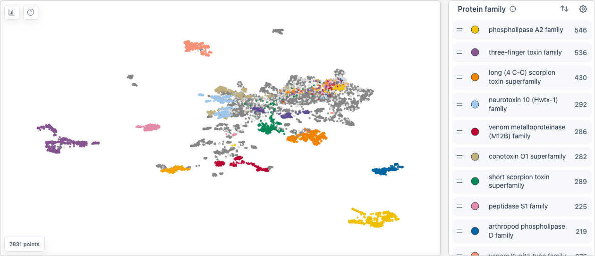
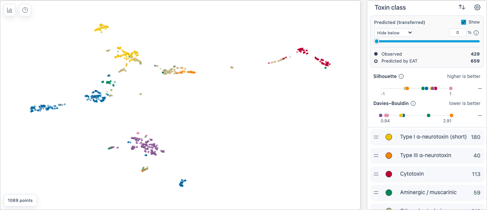
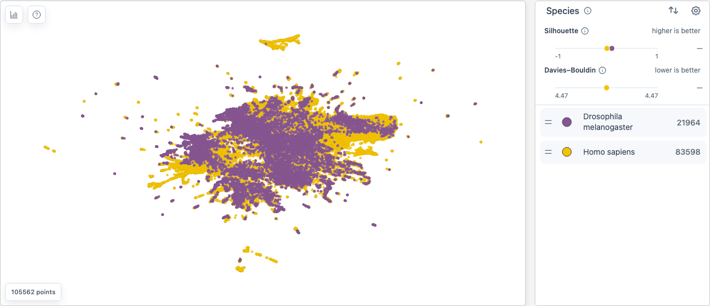
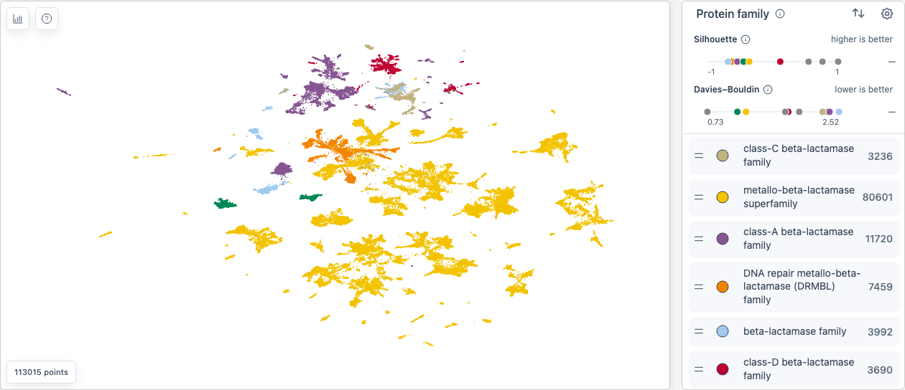
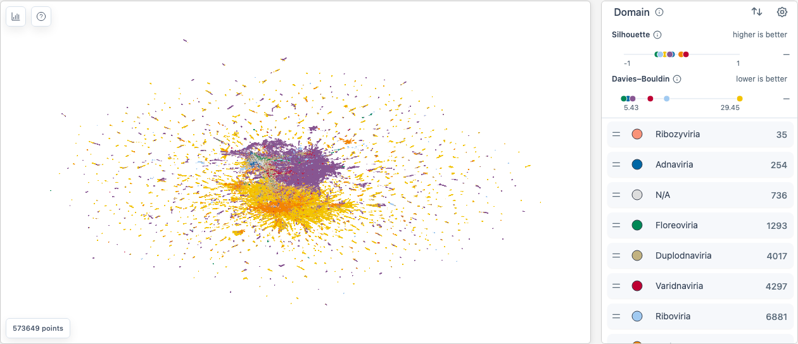

<!--
  AUTO-GENERATED: do not edit by hand.
  Catalog (menu names, insight, curated view): apps/web/src/explore/example-datasets.ts
  Bundle facts and provenance: apps/web/src/explore/example-manifest.ts
  Prose: docs/scripts/example-details.ts
  Regenerate: pnpm docs:examples
-->

# Example Datasets

The **Import** menu's **Examples** section opens these datasets: the ones behind the figures of the ProtSpace paper, the small demo ProtSpace starts with, and one example built for the web to show [annotation transfer (EAT)](/explore/eat) on a real case: [Snake three-finger toxins (EAT)](#three-finger-toxins). A link of the form `/explore?dataset=<id>` opens one directly, as each section's **Open in ProtSpace** link does. An example opens on a view chosen to show its structure straight away.

Examples always reopen in that curated view, so changes you make to one, such as legend colours, hidden categories or tooltip fields, are not kept between visits. To keep them, export the example as a `.parquetbundle` with its legend settings included and import that file. Keep the file: your copy counts as the same dataset as the example, so opening the example again resets the copy's saved settings until you import the file again. See [Data & Settings Persistence](/explore/importing-data#data-settings-persistence).

The paper's datasets keep the paper's proteins and projection coordinates, so their layouts match the figures, while their annotations were fetched again with a current ProtSpace; each section gives the releases.

Every example has a UMAP, which it opens on because UMAP draws clusters most clearly, and a PCA, a linear projection that keeps the coarse geometry UMAP distorts and stacks identical sequences on one point. Switching between the two shows how much of a picture belongs to the proteins and how much to the layout.

Figure numbers refer to the ProtSpace web-server paper and may differ from its preprint ([doi:10.64898/2026.05.04.722720](https://doi.org/10.64898/2026.05.04.722720)). To cite ProtSpace, see [How do I cite ProtSpace?](/guide/faq#how-do-i-cite-protspace). Protein data from [UniProt](https://www.uniprot.org) is used under the [CC BY 4.0](https://creativecommons.org/licenses/by/4.0/) license.

| Example                                                 | Proteins | Download | Opens on                               |
| ------------------------------------------------------- | -------- | -------- | -------------------------------------- |
| [Venom toxins (demo)](#demo)                            | 7,831    | 1.0 MB   | `ProtT5 — UMAP 2` · `protein_families` |
| [Snake three-finger toxins (EAT)](#three-finger-toxins) | 1,089    | 0.1 MB   | `ProtT5 — UMAP 2` · `toxin_class`      |
| [Human + fly](#human-fly)                               | 105,562  | 22.7 MB  | `ProtT5 — UMAP 2` · `species`          |
| [β-lactamases](#beta-lactamase)                         | 113,015  | 13.2 MB  | `ProtT5 — UMAP 2` · `protein_families` |
| [Swiss-Prot](#swissprot)                                | 573,649  | 135.9 MB | `ProtT5 — UMAP 2` · `domain`           |

## Venom toxins (demo) {#demo}



_The small dataset ProtSpace opens with: reviewed animal venom proteins._

**Toxin families such as three-finger toxins and phospholipase A2 form their own clusters.**

Each colour in the `protein_families` legend is one toxin family, and the smaller families are grouped under **Other**. Switch to an `ESM2-650M` projection to see how a second protein language model arranges the same proteins.

- **Opens on:** `ProtT5 — UMAP 2`, coloured by `protein_families`; the tooltip adds `species` and `ec`.
- **Source:** Reviewed animal proteins that UniProt links to venom, UniProtKB query `(taxonomy_id:33208) AND (cc_tissue_specificity:venom OR cc_scl_term:SL-0177) AND (reviewed:true)`.
- **Proteins:** 7,831, from UniProt release 2026_01.
- **Embedding:** ProtT5-XL-U50 and ESM2-650M, computed on the mature peptides (signal peptides removed).
- **Projections:** UMAP 2D (50 neighbours, minimum distance 0.5, Euclidean, seed 42) and PCA 2D, for each model.
- **Annotations:** 40 columns from UniProt, Taxonomy, InterPro, TED and Biocentral; releases: refreshed 2026_03, source 2026_01.
- **Extras:** None.
- **Built with:** ProtSpace 4.15.0 (git 621ea94), 2026-09-30.
- **In the paper:** Not one of the paper's figures; ProtSpace opens with it because it is small.

The sequence-based annotations (InterPro and the Biocentral predictions) were computed on the full-length sequences, signal peptides included, since that is what their sources annotate.

<a href="/explore?dataset=demo" target="_self">Open in ProtSpace</a> · <a href="/data.parquetbundle" download>Download the bundle (1.0 MB)</a>

::: details How this bundle was built

```sh
build_showcase.py build --only demo --cli-root $CLI
```

:::

## Snake three-finger toxins (EAT) {#three-finger-toxins}



_Annotation transfer on a real case: toxin classes for snake venom toxins that UniProt has not classified._

**Rings are toxin classes EAT transferred from the nearest reviewed toxin; held-out reviewed toxins get the right class back 94 % of the time.**

Coloured by `toxin_class`, each colour is one functional class of three-finger toxin. The reviewed toxins carry the class UniProt curators give them. The unreviewed ones, 552 toxins mostly sequenced from venom glands, have none, and [EAT](/explore/eat) transferred one from the nearest reviewed toxin; they are drawn as hollow rings. A fifth of the reviewed toxins, 107, were held out: their class was withheld and transferred like the others, and `toxin_class_withheld` in the tooltip shows the truth, so you can check each of those transfers yourself. The transferred class is right for 101 of them (94 %), and for all 95 that EAT transferred at a reliability of 0.5 or more. The reliability filter starts at 0, so every transfer is shown and the [separation score](/explore/separation-scores) strips stay visible. Drag the reliability filter to 50 % (a reliability of 0.5): the least certain transfers, the rings between the islands, disappear first. Then colour by `eat_split` to see the references, the held-out toxins and the unreviewed queries.

- **Opens on:** `ProtT5 — UMAP 2`, coloured by `toxin_class`; the tooltip adds `toxin_class_withheld`, `species` and `eat_split`.
- **Source:** UniProtKB query `(xref:interpro-IPR003571 OR family:"three-finger toxin family") AND (taxonomy_id:8570)`: the three-finger toxins of snakes, reviewed and unreviewed. `toxin_class` groups the subfamily and sub-subfamily that UniProt curators record for each reviewed toxin into functional classes such as the type I, II and III α-neurotoxins, the cytotoxins and the κ-neurotoxins. The held-out fifth was drawn within each class with a recorded seed, and `eat_split` records the draw.
- **Proteins:** 1,089, from UniProt release 2026_03.
- **Embedding:** ProtT5-XL-U50, computed on the mature chains, cut by the same rule for reviewed and unreviewed toxins: signal peptides removed, and the propeptide the curators mark on some colubrid toxins removed from their unreviewed relatives too. Most unreviewed entries are precursors that still carry their signal peptide, while many reviewed ones are mature chains sequenced as protein; embedded as they are, the toxins would group by whether they carry a signal peptide rather than by class.
- **Projections:** UMAP 2D (25 neighbours, minimum distance 0.1, Euclidean, seed 42) and PCA 2D. Transfer: EAT with k = 1 and the Euclidean distance.
- **Annotations:** 35 columns from UniProt, Taxonomy, InterPro, TED and Biocentral; releases: refreshed 2026_03, withheld-truth 2026_03.
- **Extras:** [transferred annotations (EAT)](/explore/eat) for `toxin_class` and `toxin_subfamily` and [separation scores](/explore/separation-scores).
- **Built with:** ProtSpace 4.15.0 (git 621ea94), 2026-09-30.
- **In the paper:** Not one of the paper's datasets. The paper's annotation-transfer sets are benchmarks, built to measure transfer rather than to show it, so this example was built for the web; their exact files stay in the paper's data deposit.

The classes are the curators' subfamilies, assigned from sequence similarity, not measured activities.

One reviewed toxin, the muscarinic toxin Mlalpha (P0DJB0), has no curated subfamily and so no `toxin_class`; it is the single N/A in the legend.

A random hold-out leaves most held-out toxins with relatives from their own genus among the references. Annotating a genus EAT has never seen is harder: in a pilot on full-length sequences that held out whole genera, the transferred class was right for about 70 % of the toxins, and for about 85 % above reliability 0.5.

_Naja_ (the cobras) supplies 183 of the 537 reviewed toxins, about a third, so the references lean towards cobra toxins.

116 of the 552 unreviewed toxins, about a fifth, are fragments.

The sequence-based annotations (InterPro and the Biocentral predictions) were computed on the full-length sequences, signal peptides included.

<a href="/explore?dataset=three-finger-toxins" target="_self">Open in ProtSpace</a> · <a href="/examples/three-finger-toxins_2026_03.parquetbundle" download>Download the bundle (0.1 MB)</a>

::: details How this bundle was built

```sh
build_showcase.py build --only three-finger-toxins --cli-root $CLI
```

:::

## Human + fly {#human-fly}



_Two reference proteomes in one layout._

**Most families overlap across species (about 2,000 protein kinases). Recolour by protein family to find human-only MHC class I/II, β-defensins and CC chemokines and fly-only odorant-binding proteins.**

Coloured by `species`, human and fly proteins share most of the map, and the regions only one species occupies are where its own families sit. That overlap is the point of the view, which is why the separation score for `species` is close to zero. Recolour by `protein_families`: conserved families such as the protein kinases (about 2,000 proteins, three quarters of them human) sit in the shared region, while MHC class I and II, β-defensins and CC chemokines are human-only and the odorant-binding proteins (PBP/GOBP family) are fly-only.

- **Opens on:** `ProtT5 — UMAP 2`, coloured by `species`; the tooltip adds `protein_families` and `reviewed`.
- **Source:** The reference proteomes UP000005640 (_Homo sapiens_) and UP000000803 (_Drosophila melanogaster_), with the paper's protein set.
- **Proteins:** 105,562, from UniProt release 2025_04.
- **Embedding:** ProtT5-XL-U50 per-protein embeddings from UniProt.
- **Projections:** UMAP 2D (50 neighbours, minimum distance 0.2, Euclidean, seed 42) and PCA 2D, both the paper's coordinates.
- **Annotations:** 40 columns from UniProt, Taxonomy, InterPro and TED; releases: refreshed 2026_03.
- **Extras:** [separation scores](/explore/separation-scores).
- **Built with:** ProtSpace 4.15.0 (git 621ea94), 2026-09-30.
- **In the paper:** Fig. 2B.

UniProt no longer publishes an embedding for 146 of these proteins; they keep their position from the paper.

The paper counts 1,703 protein kinases; this build counts about 2,000, mostly because UniProt has since given unreviewed entries an automatic family annotation.

74 of the paper's accessions have no current UniProt entry, so their UniProt annotations are empty. Another 139 rows carry accessions that UniProt has since merged into another entry of the set, so 111 current entries appear more than once (one of them six times).

This bundle has no Biocentral predictions (the `predicted_*` columns). Their models read per-residue ProtT5 embeddings, which UniProt does not publish, so they would have to be computed for every protein: 10 to 25 hours per 100,000 proteins on the public Biocentral server. Signal peptides are still covered, by the Phobius `signal_peptide` column.

<a href="/explore?dataset=human-fly" target="_self">Open in ProtSpace</a> · <a href="/examples/human-fly_2026_03.parquetbundle" download>Download the bundle (22.7 MB)</a>

::: details How this bundle was built

```sh
build_showcase.py build --only human-fly --cli-root $CLI
```

:::

## β-lactamases {#beta-lactamase}



_One enzyme superfamily across all of life._

**The serine β-lactamase classes A, C and D sit apart from the metallo-β-lactamases that fill most of the map. Q02940, curated as class C, sits away from the other class-C proteins.**

Coloured by `protein_families`, the serine β-lactamases of Ambler classes A, C and D sit in their own regions, apart from the metallo-β-lactamase superfamily, which makes up about 70 % of the entries and spreads over most of the map. That catch-all is why the separation score for the whole annotation is low. Search for Q02940: curated as class C, it sits away from the other class-C proteins, a candidate misannotation. Then colour by `ec`, whose categories follow the clusters of the layout closely.

- **Opens on:** `ProtT5 — UMAP 2`, coloured by `protein_families`; the tooltip adds `ec` and `species`.
- **Source:** Every UniProtKB entry returned by the query `family:"beta-lactamase"` at release 2026_02, unfiltered: the paper's 113,015 proteins. The same query returns 116,260 at 2026_03, because 3,324 entries created in 2026_02 received their family annotation only in the next release.
- **Proteins:** 113,015, from UniProt release 2026_02.
- **Embedding:** ProtT5-XL-U50 per-protein embeddings from UniProt.
- **Projections:** UMAP 2D (200 neighbours, minimum distance 0.4, Euclidean, seed 42) and PCA 2D, both the paper's coordinates.
- **Annotations:** 40 columns from UniProt, Taxonomy, InterPro and TED; releases: refreshed 2026_03.
- **Extras:** [separation scores](/explore/separation-scores).
- **Built with:** ProtSpace 4.15.0 (git 621ea94), 2026-09-30.
- **In the paper:** Fig. 3.

In the paper's statistics the class C proteins stood out, with a silhouette of +0.32 in the embedding; with the refreshed labels they score about +0.17 there and below zero on the UMAP. UniProt has relabelled β-lactamases since (class C grew from 3,140 to 3,236 proteins), and proteins with several families now count as categories of their own.

78 of the paper's accessions have no current UniProt entry, so their UniProt annotations are empty.

This bundle has no Biocentral predictions (the `predicted_*` columns). Their models read per-residue ProtT5 embeddings, which UniProt does not publish, so they would have to be computed for every protein: 10 to 25 hours per 100,000 proteins on the public Biocentral server. Signal peptides are still covered, by the Phobius `signal_peptide` column.

<a href="/explore?dataset=beta-lactamase" target="_self">Open in ProtSpace</a> · <a href="/examples/beta-lactamase_2026_03.parquetbundle" download>Download the bundle (13.2 MB)</a>

::: details How this bundle was built

```sh
build_showcase.py build --only beta-lactamase --cli-root $CLI
```

:::

## Swiss-Prot {#swissprot}



_Every reviewed UniProtKB protein in one map._

**Bacterial and eukaryotic proteins fill the two halves of the dense core; archaeal proteins form small patches of their own among the bacterial ones.**

The colours are `domain`: the domain of life, or the realm for viruses. Scored over the whole map the domains separate poorly, because bacterial and eukaryotic proteins each spread over large areas, and no domain scores well on its own. Colour by `pfam`: a protein with several Pfam families is drawn as a pie. Search for P12931 (SRC) to see one.

- **Opens on:** `ProtT5 — UMAP 2`, coloured by `domain`; the tooltip adds `protein_families` and `species`.
- **Source:** All reviewed UniProtKB/Swiss-Prot entries that UniProt publishes a ProtT5 embedding for (it computes none for sequences over 12,000 residues), the paper's protein set.
- **Proteins:** 573,649, from UniProt release 2025_04.
- **Embedding:** ProtT5-XL-U50 per-protein embeddings from UniProt.
- **Projections:** UMAP 2D (500 neighbours, minimum distance 0.2, Euclidean, seed 42) and PCA 2D, both the paper's coordinates.
- **Annotations:** 40 columns from UniProt, Taxonomy, InterPro and TED; releases: refreshed 2026_03.
- **Extras:** [separation scores](/explore/separation-scores).
- **Built with:** ProtSpace 4.15.0 (git 621ea94), 2026-09-30.
- **In the paper:** Fig. 2A and the abstract.
- **Large:** a 135.9 MB download that needs at least 1.2 GB of browser memory and takes about 30 s on a fast laptop to load.

The viral realm Fig. 2A labels Monodnaviria appears here as Floreoviria (1,293 proteins): NCBI Taxonomy has renamed it since.

`domain` is empty for 736 proteins: 706 viruses that NCBI Taxonomy places in no realm, and 30 of the paper's accessions that have no current UniProt entry. Another 15 current entries appear twice, under their own accession and under one since merged into them.

This bundle has no Biocentral predictions (the `predicted_*` columns). Their models read per-residue ProtT5 embeddings, which UniProt does not publish, so they would have to be computed for every protein: 10 to 25 hours per 100,000 proteins on the public Biocentral server. Signal peptides are still covered, by the Phobius `signal_peptide` column.

<a href="/explore?dataset=swissprot" target="_self">Open in ProtSpace</a> · <a href="/examples/swissprot_2026_03.parquetbundle" download>Download the bundle (135.9 MB)</a>

::: details How this bundle was built

```sh
build_showcase.py build --only swissprot --cli-root $CLI
```

:::

## Next Steps

- [Importing Data](/explore/importing-data) - open your own `.parquetbundle` or FASTA file
- [Using Python CLI](/guide/python-cli) - build a bundle like these from your own proteins
